This is a [Next.js](https://nextjs.org/) project bootstrapped with [`create-next-app`](https://github.com/vercel/next.js/tree/canary/packages/create-next-app).

## Getting Started

To get started with the project locally, follow these steps:

1. Clone the repository:
   git clone https://github.com/SenhuiZhao/next-js-ecommerce.git

2. Install the dependencies:
   npm install

3. Start the development server:
   npm run dev

4. Open http://localhost:3000 in your browser to see the application.

## Project View

Client:
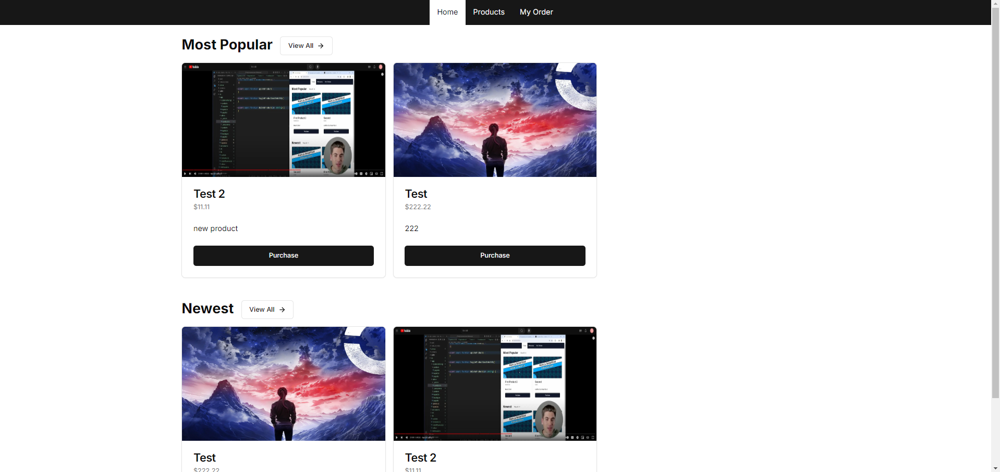
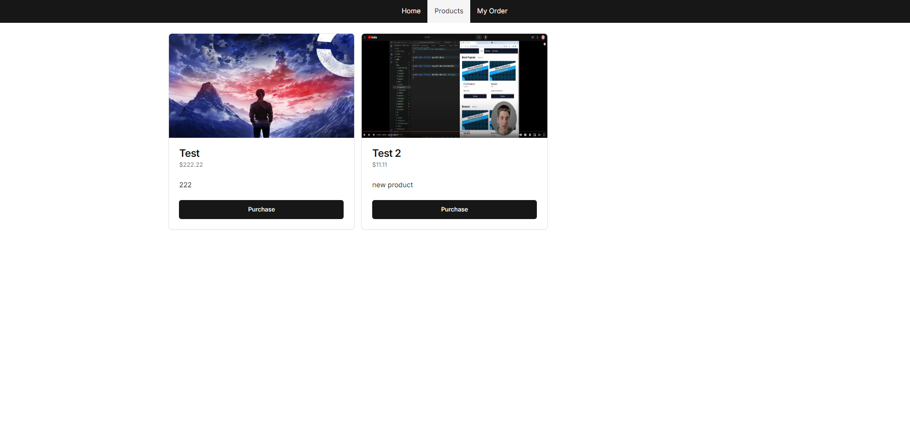
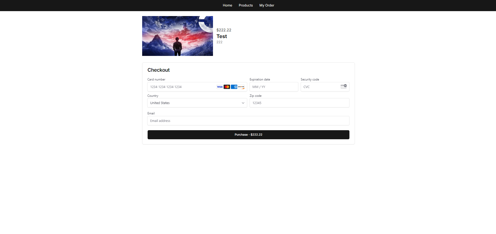
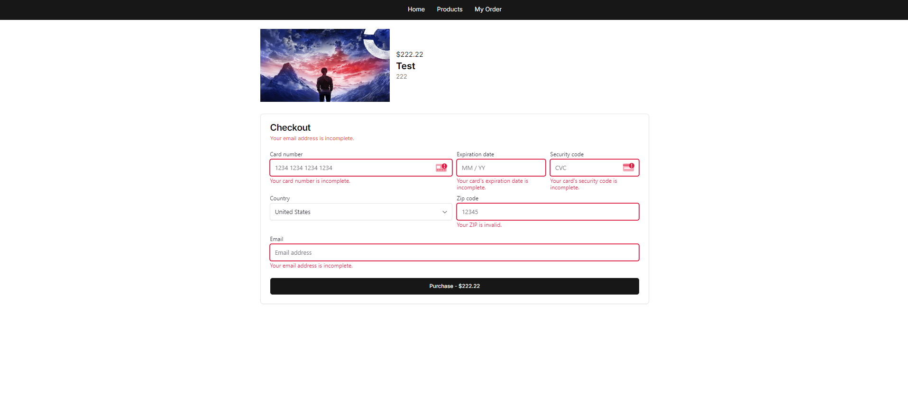
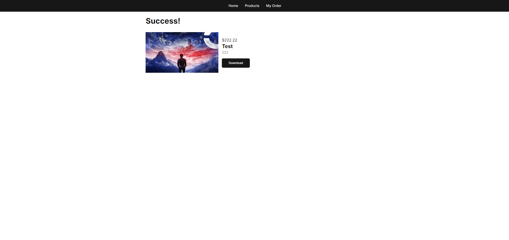
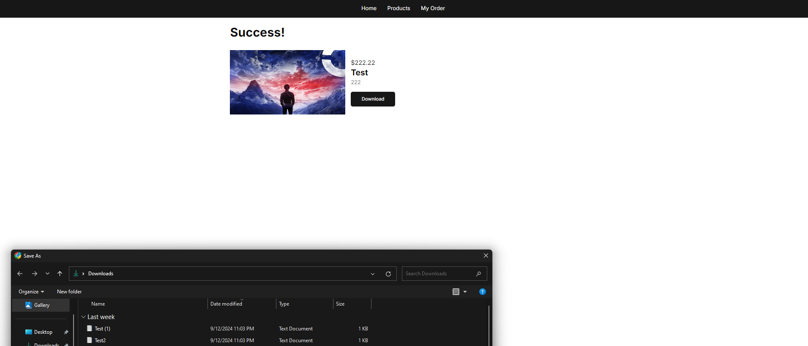
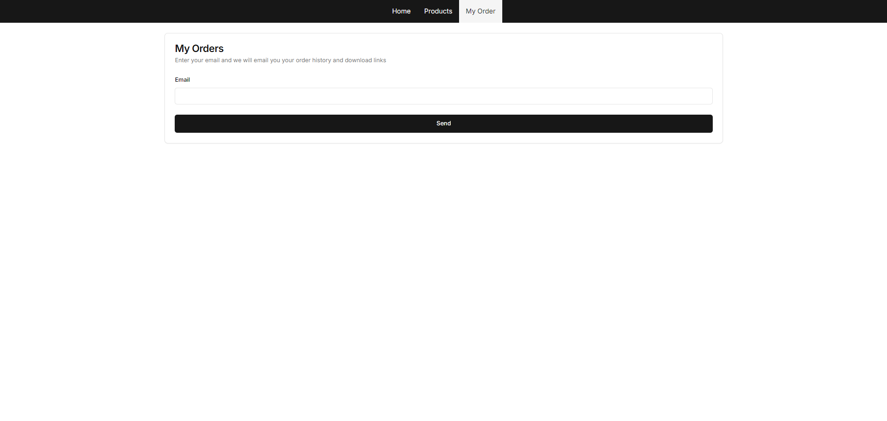

Admin:
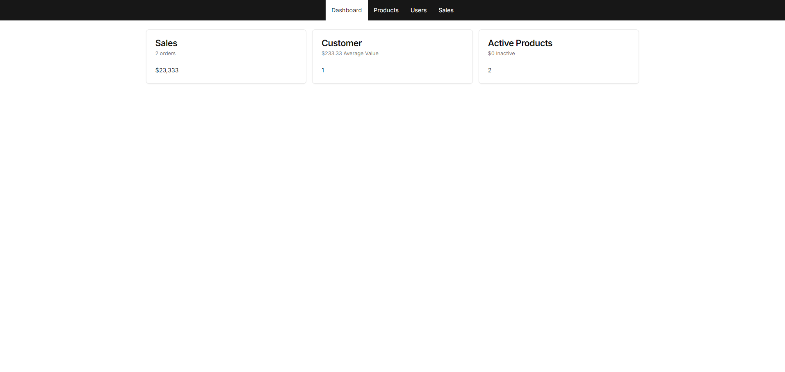
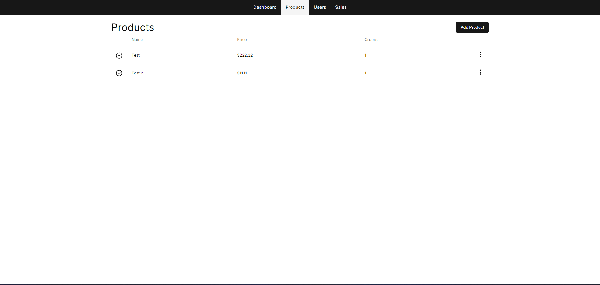
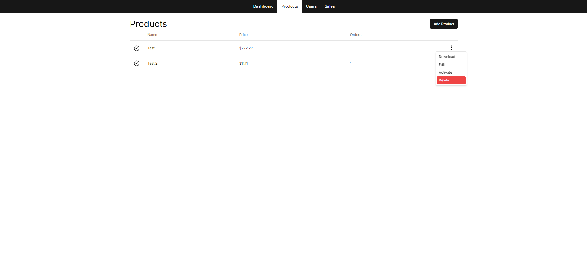
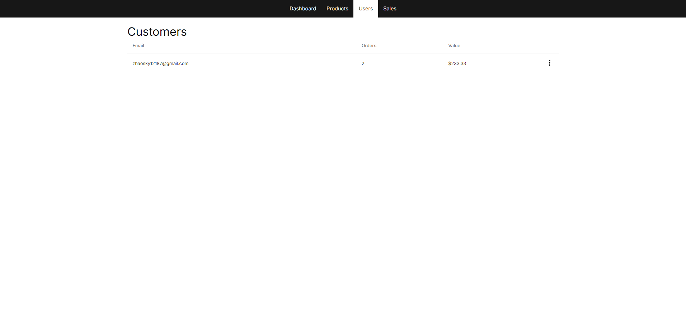
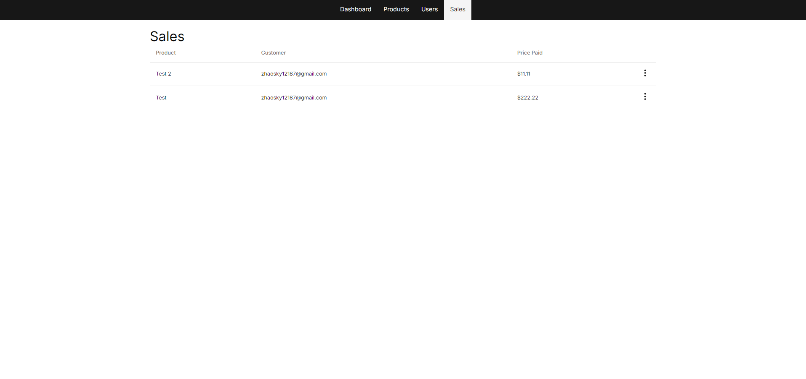

Email:
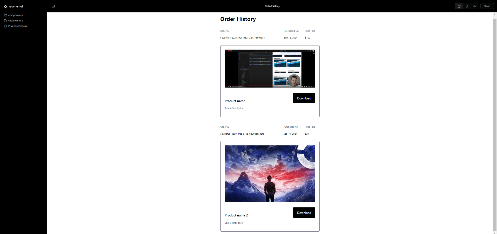
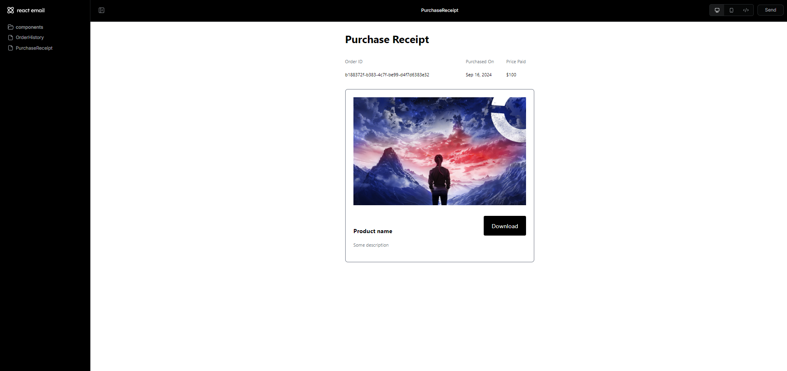

## Stripe Webhook

Running the Stripe Webhook Listener
To enable Stripe webhooks, you need to log in to Stripe and listen for webhook events:

Log in to Stripe:
stripe login

Start the Stripe listener to forward events to your local server:
stripe listen --forward-to localhost:3000/webhooks/stripe

## React Email

1. Start the development server:
   npm run email

2. Open http://localhost:3001 in your browser to see the application.

## Features

Product Listing: Display a list of available products.
Product Detail Page: View detailed information about each product.
Shopping Cart: Add items to the cart and manage cart contents.
Checkout Process: Users can proceed through the checkout process.
Stripe Integration: Payment processing via Stripe API.
Responsive Design: Fully responsive layout for mobile, tablet, and desktop views.
